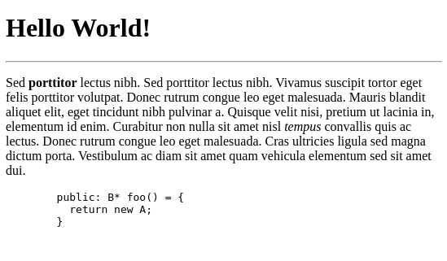

# Lezione 1

## Programmazione Web

La programmazione web è dipendente dagli obiettivi dell'applicazione sviluppata ed è strettamente legata alla scelta tra Web statico e Web dinamico. <br>
Il primo approccio è quello originario del Web e consiste nella stesura di documenti formattati direttamente in codice [HTML](?id=html) e caratterizzati da una bassa interazione con l'utente, vedi [Ipertesto](https://www.w3.org/WhatIs.html). <br>
Il secondo, rappresenta invece l'evoluzione delle applicazioni Web con l'inserimento di processi di automazione ed una maggiore interattività con l'utente.
Il web dinamico fa sovente uso di database e di linguaggi di scripting elaborati dal server oppure dal client quali ad esempio PHP, ASP, .NET, JavaScript, Python: questi codici una volta in esevuzione restituiscono codice HTML al [web browser](https://www.mozilla.org/en-US/firefox/browsers/what-is-a-browser/) dell'utente.

## HTML

### I Tag

Le entità che definiscono la struttura della pagina, consentendo ad altre tecnologie lato client (CSS, JavaScript) di interagirvi contribuendo alla realizzazione dell'interfaccia presentata all'utente.
Tutte le informazioni necessarie a queste interazioni sono contenute all'interno di **attributi**, composti da chiave e valore. <br>
I tag possono permettere l'inserimento di contenuto al loro interno, o rappresentare uno specifico elemento che non possiede entità annidate - detto **Self Closing Tag**.

?> In quanto utilizzati nel codice sottostante, la sintassi dei commenti è
`<!-- contenutoCommento -->`

```html
<tag chiaveAttr="valoreAttr">contenuto</tag> <br />
<!-- 
  Il tag <br/> è utilizzato per forzare il ritorno 
  a capo, è un esempio di Self Closing Tag
-->
<selfClosingTag chiaveAttr="valoreAttr" />
```

Vengono inseriti all'interno di un documento con estensione `.html` e richiedono una specifica struttura (boilerplate).

```html
<!DOCTYPE html>
<!-- Definizione del tipo documento -->

<html lang="it">
  <!-- Il tag "init", che contiene tutti gli altri tag del foglio -->

  <head>
    <!-- 
      Contiene informazioni non visibili nell'iterfaccia.
      Utilizzato per collegamenti a contenuti esterni e, ad esempio, 
      dati su autore e parole chiave a fini SEO (vedi glossario) 
    -->

    <meta charset="UTF-8" />
    <!-- Definisce il character encoding del documento -->

    <meta name="viewport" content="width=device-width, initial-scale=1.0" />
    <!-- Comunica al browser i parametri per gestire
     le dimensioni della pagina e relativa scala -->

    <title>La mia Pagina HTML</title>
    <!-- Titolo visualizzato nella tab del browser e utilizzato (in parte) dai motori di ricerca. -->
  </head>
  <body>
    <!-- Tutto il contenuto visibile della pagina è chiuso qui -->
  </body>
</html>
```

?> In qualsiasi editor che integri [Emmet](https://emmet.io/), è possibile attivare l'inserimento automatico del boilerplate digitando `!` e utilizzando il primo suggerimento.

### Hello World

La nostra prima pagina web. Include alcuni dei tag più semplici offerti dal linguaggio.

```html
<!DOCTYPE html>
<html lang="it">
  <head>
    <meta charset="UTF-8" />
    <meta name="viewport" content="width=device-width, initial-scale=1.0" />
    <title>La mia Pagina HTML</title>
  </head>
  <body>
    <h1>Hello World!</h1>
    <hr />
    <p>
      Sed <strong>porttitor</strong> lectus nibh. Sed porttitor lectus nibh.
      Vivamus suscipit tortor eget felis porttitor volutpat. Donec rutrum congue
      leo eget malesuada. Mauris blandit aliquet elit, eget tincidunt nibh
      pulvinar a. Quisque velit nisi, pretium ut lacinia in, elementum id enim.
      Curabitur non nulla sit amet nisl <em>tempus</em> convallis quis ac
      lectus. Donec rutrum congue leo eget malesuada. Cras ultricies ligula sed
      magna dictum porta. Vestibulum ac diam sit amet quam vehicula elementum
      sed sit amet dui.

      <pre> <!-- Mantiene invariata la formattazione del contenuto, utilizzato solitamente per includere del codice nella pagina -->
        public: B* foo() = {
          return new A;
        }
      </pre>
    </p>
  </body>
</html>
```

#### Risultato 👇



---

### Reference HTML

Riportare i tag e la loro descrizione sarebbe superfluo e finirebbe per essere riduttivo e limitante. <br>
Il Mozzilla Developer Network offre una completa raccolta di tutti gli elementi HTML con nozioni teoriche, dettagli, approfondimenti e riferimenti pratici.
[Link Qui 🔗](https://developer.mozilla.org/en-US/docs/Web/HTML/Reference) <br>
MDN può aiutarci anche con diverse altre tecnologie web lato client.

---
